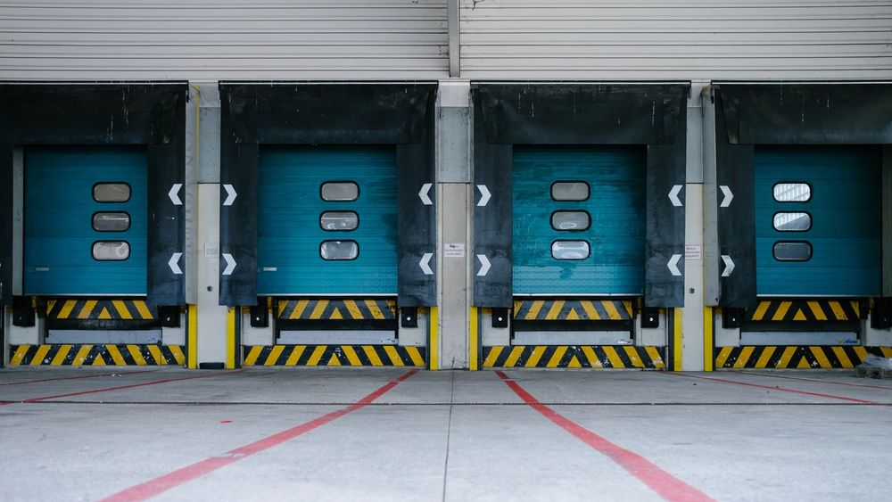

# Die Bedeutung von Lieferanten im Kontext der modernen Beschaffung am Beispiel

## Einführung

Die vorliegende Arbeit soll die Grundzüge der Bedeutung von Lieferanten im
Wertschöpfungsprozess herausstellen und diese anhand eines ausgewählten
Unternehmensbeispiels verstärken. Ziel dieser Arbeit ist es, der Fragestellung
nachzugehen, welche Relevanz und Innovationsstärke von Lieferanten für
Unternehmen ausgeht, um somit Ansatzpunkte für weitere ausführlichere
Forschungsarbeiten darzustellen. Zu Beginn dieser wissenschaftlichen
Auseinandersetzung wird vorab kurz der Wandel der Beschaffung näher
betrachtet, um anschließend die Position der Lieferanten in der
Wertschöpfungskette bzw. im Unternehmen nachvollziehen zu können.

### Vom Kostenoptimierer zur Innovationskraft

**„Reich wird man nicht durch das, was man verdient, sondern durch das, was man nicht ausgibt.“** (Henry Ford, zitiert nach Lorenzens und Krokowski, 2018, S. 13)

In von Innovationen geprägten Unternehmen gilt die Bedeutung des
modernen Einkaufs heutzutage als unumstritten. Damit der Wandel zum
strategisch ausgerichteten und vor allem zum Werte gestaltenden Einkauf
funktioniert, müssen die Beschäftigten hierfür über die notwendigen
Kompetenzen verfügen (Lorenzen und Krokowski, 2018, S. 2). Das Aufbauen
langfristiger Lieferantenbeziehungen gehört ebenso wie das Aufbauen
strategischer Partnerschaften zu den zentralen Aufgaben der modernen
Beschaffung (Hofbauer, Mashhour und Fischer, 2009, S. 1). Während der
traditionelle Einkauf nach Hofbauer et al. (2009, S. 2) durch Begrifflichkeiten wie
“Kostendrücker” und “Handlanger der Entwicklung” beschrieben wurde, werden
mit dem modernen Einkauf neue Anforderungen assoziiert. Abgerückt vom
Fokus des traditionellen Einkaufs auf die Gestaltung des optimalen Preises,
gelten nun unter anderem Qualität, Flexibilität, Wettbewerbsfähigkeit und
Innovation als die neuen Entscheidungsparameter (Hofbauer, Mashhour und
Fischer, 2009, S. 1). Präuer (2017, S. 1) spricht von der zunehmenden
Wahrnehmung des Beschaffungsmanagements als professioneller Enabler
und Keyplayer für nachhaltige Wettbewerbsvorteile durch das Verwenden der
Potenziale auf dem Lieferantenmarkt.
Die Analyse von Märkten, Technologien und Lieferanten hat an neuer
Bedeutung gewonnen. Während der Einkauf vor einigen Jahren noch mit der
Funktion des Kostenoptimierers gleichgesetzt wurde, dessen Hauptaufgabe
darin bestand, Produktionsteile zu den günstigsten Konditionen zu erwerben,
hat sich die Funktion mittlerweile deutlich gewandelt. Als eine der
Hauptaufgabe des Einkaufs gilt inzwischen, als Wertgestalter zu agieren und
auf Produktionsentstehungsprozesse aktiv einzuwirken. Hierbei steht vor allem
das rechtzeitige Identifizieren und Definieren des optimalen Lieferanten im
Fokus (Hofbauer, Mashhour und Fischer, 2009, S. 2). Heute versteht sich der
Einkauf als strategisch ausgerichteter Gestalter der Beziehungen zwischen
Lieferanten und Bedarfsträgern. Die zukunftsfähige Beschaffung stellt den Aufbau langfristiger partnerschaftlicher Beziehungen in den Vordergrund, die
das frühe Einbinden von Lieferanten beinhalten. Die Gründe für diesen Wandel
sind vielfältig. Neue Datenübertragungs- und Datenverarbeitungsformen, das
veränderte Kundenverhalten, der Zugang zu internationalen Märkten und die
Globalisierung sind nur einige von vielen Gründen, welche den Wandel der
Beschaffung maßgeblich begründen (Hofbauer, Mashhour und Fischer, 2009,
S. 4).

## Einordnung des Lieferanten im Unternehmen

Die Einordnung des Lieferanten in der Wertschöpfungskette des
Unternehmens zu kennen, ist Voraussetzung dafür, die Bedeutung des
Lieferanten besser nachvollziehen zu können. Der Lieferant kennzeichnet den
Beginn des Wertschöpfungsprozesses. Der Material- und Güterfluss startet mit
der Lieferung des Lieferanten an das Unternehmen und erstreckt sich dann
über die Bereiche des Wareneingangs und der Produktion, bis die
fertiggestellten Waren über die Auslieferungslager zum Kunden gelangen.
Meist endet die Aufgabe des Lieferanten nicht bei der reinen Zulieferung der
benötigten Produktionsteile, denn viele Lieferanten sind auch für das
Entsorgen von Verpackungen und Abholen von Leergut und Recyclinggütern
zuständig (Kummer, Grün und Jammernegg, 2009, S. 31).
Die Beschaffung gestaltet sich für die Unternehmen einfacher, wenn sie auf
einen Pool von mehreren Lieferanten zurückgreifen können, anstatt auf einen
einzelnen Lieferanten angewiesen zu sein (Koether, 2018, S. 34). Um Lieferanten
erfolgreich in Unternehmensprozesse involvieren zu können, müssen diese
über bestimmte Kompetenzen und Begebenheiten verfügen. Eine gelungene
Integration bedarf Offenheit, Kooperationsbereitschaft sowie kompatibler Technologien und Prozesse. Des Weiteren ist vorauszusetzen, dass die
Lieferanten im Besitz der notwendigen Infrastruktur und Ressourcen sind
(Müller, Veile und Voigt, 2019, S. 172).
Festzuhalten ist, dass der Unternehmenserfolg in größer werdendem Maße
durch die Fähigkeiten der Zulieferer bestimmt wird (Janker, 2008, S. 2).

## Einbezug der Innovationskraft der Lieferanten am Beispiel von ZF

Nachhaltige Produktentwicklung und der Leitspruch “Innovationen, die sich
rechnen” kennzeichnen das Unternehmen ZF maßgeblich. Das Augenmerk des
Unternehmens liegt auf der umweltfreundlichen und wirtschaftlichen
Gestaltung der Produkte durch das Anwenden intelligenter Technologien. Als
einer der zehn größten Automobilzulieferer weltweit mit insgesamt 121
Produktionsgesellschaften in 26 Ländern greift ZF auf ein großes
Lieferantennetzwerk zurück. Ein durchschnittliches ZF Produkt besteht zu etwa
60% aus zugelieferten Materialen. Das weltweite Netzwerk des Unternehmens
allein für den Bezug von Produktionsmaterialen besteht aus circa 3.500
internationalen Lieferanten. Für den Betriebsbedarf greift ZF auf circa 25.000
Lieferanten zurück. Produkte und Prozesse noch effizienter und innovativer
aktiv mitzugestalten, fällt ebenfalls in den Aufgabenbereich der Lieferanten
(Schmitt, 2015, S. 161). Um dem eigenen Anspruch gerecht werden zu können,
das Unternehmen nachhaltiger zu gestalten, setzt ZF auf die frühe Integration
der Lieferanten in den Entwicklungsprozess. Hier wird den Lieferanten die
Möglichkeit geboten, ihre Innovationskraft unter Beweis zu stellen, um dadurch
Qualifikations- und Produktionsrisiken schneller zu erkennen und zu
minimieren. Auch das Einbeziehen von Mitarbeitern, Kunden und Zulieferern in die Umsetzung der Umwelt- und Energiepolitik ist für das Unternehmen von
großem Stellenwert. Die Einhaltung von gültigen Umwelt- und
Energievorschriften ist eine grundsätzliche Erwartung, welche an die Zulieferer
und Dienstleister von ZF gestellt werden. Darüber hinaus müssen Lieferanten,
welche mit besonders umweltrelevanten Prozessen arbeiten, dem
Unternehmen ein zertifiziertes Umweltmanagementsystem nachweisen
können. Überprüft wird die Einhaltung dieser Lieferanten-Richtlinien von der
Materialwirtschaft im Rahmen von “Sustainability Audits” (Schmitt, 2015, S.
163-166).
Generell lässt sich festhalten, dass die Beschaffung immer weiter in den Fokus
unternehmerischen Handelns rückt und folglich bedingt, dass die
Beschaffungsstrategien konsequent in die Gesamtstrategie des
Unternehmens eingepflegt werden müssen, damit der Wertbeitrag der
Beschaffung sichtbar wird (Fröhlich, 2014, S. 11).
Auch die Automobilbranche steht vor großen Herausforderungen und vor
veränderten Aufgaben entlang der Wertschöpfungskette. Deswegen werden
Automobilzulieferer aktiv in die Produktentwicklung einbezogen und müssen
Investitionen beispielsweise für neue Technologien aufbringen. ZF sieht es als
essentiell an, die Lieferanten frühzeitig einzubinden, damit insbesondere die
Komplexität der Wertschöpfungskette reduziert wird und die Möglichkeit
besteht, innovative Ideen und Konzepte rechtzeitig zu erkennen und zeitnah zu
nutzen. Gerade in der Automobilindustrie werden Innovationen als ein
bedeutsamer Wettbewerbsfaktor gesehen. Das Entwickeln und Verfolgen der
richtigen Wertschöpfungsstrategien sind Kompetenzen, die nun von den
Zulieferern gefordert werden (Schmitt, 2015, S. 163-166). **Doch welche Strategie verfolgt das Unternehmen, um den Innovationsansätzen der Lieferanten gerecht zu werden? Und wie gelingt es ZF, diese Ansätze zu übertragen, damit es zum gegenseitigen Informationsaustausch kommen kann?**
ZF greift hier auf die Stelle des Innovationsmanagers zurück, welche explizit für
diese Aufgaben im Bereich der Materialwirtschaft geschaffen wurde.
Lieferanteninnovationen aktiv zu forcieren und diese anschließend in den
Produktentwicklungsprozess zu integrieren, fällt unter die Hauptaufgaben
eben dieser Stelle. Durch die Einbindung der Innovationskraft der Lieferanten
war es dem Unternehmen beispielsweise möglich, das Gewicht eines
Aluminium-Leichtbaudämpfers zu halbieren (Schmitt, 2015, S. 166). ZF hat die
Stelle des Innovationsmanagers im Unternehmen geschaffen, um zu
vermeiden, dass Kunden von Lieferanteninnovationen zu spät oder überhaupt
nicht erfahren. Implementiert wurde der Innovationsmanager als Schnittstelle
der Materialwirtschaft zu angrenzenden Abteilungen, um so das frühzeitige
Prüfen der Innovationen sicherstellen zu können. Dadurch ist es möglich, dass
frühzeitige Erneuerungen in die Produktentwicklung einfließen können und die
Produktoptimierungen gemeinsam mit dem Lieferanten durchzuführen. Ziel ist
es, durch die enge Zusammenarbeit mit dem Lieferanten dem zunehmenden
Wettbewerbsdruck zu begegnen und die Position ZFs zu stärken. Darüber
hinaus fungiert der Innovationsmanager als Ansprechpartner beispielsweise
für dezentrale Einkaufs- und Entwicklungsbereiche, welche auf der Suche nach
innovativen Lösungen von Lieferanten sind. Außerdem steuert der
Innovationsmanager mit Hilfe der Forschung und Entwicklung sowie der
Produktion, die Produkt-, Teile- und Prozess-Innovationen zwischen dem
Unternehmen und dessen weltweiten Lieferanten. Das Planen und
Durchführen von Innovations-Workshops mit den Lieferanten ist eine der
verwendeten Methoden, um ein frühzeitiges Identifizieren von
Lieferanteninnovationen leisten zu können. Dokumentiert werden die
Informationen mit Hilfe der Innovationsdatenbank, um den Schnittstellen
anschließend zur Verfügung gestellt zu werden. Die Visualisierung der
Lieferanteninnovationen wird mit Hilfe von „Lieferanten-Innovations-
Roadmaps“ durchgeführt (Schmitt, 2015, S. 166-168). Durch Maßnahmen wie
diese kommt es zu einer Verbesserung der Innovationskraft und auch der
globale Footprint in Forschung und Entwicklung wird erweitert. Das
Unternehmen greift auf etwa 8.000 Entwickler zurück. Es würde zu einer
Steigerung der Entwicklungsressourcen im hohen fünfstelligen Bereich
kommen, wenn ZF das Entwicklungsnetz seiner Lieferanten nutzt. Ein weiterer
von Schmitt (2015, S. 168) herausgearbeiteter Vorteil aus der aktiven Nutzung
der Lieferanteninnovationskraft stellt die Erhöhung der Flexibilität dar. Zulieferer
sind demnach in der Lage, die eignen Ressourcen effizienter einzusetzen und
folglich auf Trends und Kundenanforderungen kurzfristig reagieren zu können.

## Ausblick

Fasst man die in dieser wissenschaftlichen Arbeit dargestellten Informationen
zusammen, lässt sich festhalten, dass die Beschaffung in den letzten
Jahrzehnten einem deutlichen Wandel unterzogen wurde. Den Lieferanten
wird mittlerweile in vielen Unternehmen eine Rolle zuteil, die aktive Einbringung
in Produktentstehungsprozesse fordert und die Integration in Unternehmen
mit sich bringt. Dabei kann das Unternehmen von der Innovationskraft des
Lieferanten profitieren und seine Wettbewerbsfähigkeit stärken. Anhand eines
Unternehmensbeispiels wurde herausgearbeitet, wie Lieferanten erfolgreich
integriert werden, die Ideen und Innovationen frühzeitig aufgreift und diese
aktiv umsetzt. Die vorliegende Arbeit stellt diese weitaus tiefgreifendere Thematik allerdings nur in ihren Grundzügen vor. Vielmehr soll diese auf
Fachliteratur basierende Auseinandersetzung als Anregung für weitere
wissenschaftliche Arbeiten und Forschungen dienen. Hier könnte
beispielsweise der Frage nachgegangen werden, welche weiteren Methoden
der Lieferantenintegration bereits vorliegen oder wie die Förderung von
Lieferanten aufgebaut werden soll, um größtmöglichen Erfolg zu erzielen. Die
vorangestellte Arbeit hat verdeutlicht, dass es sich um eine aktuelle und für die
Zukunft bedeutsame Thematik handelt, die viele Möglichkeiten zur weiteren
Forschung bietet.

## Literaturverzeichnis

Bilder:
[unsplash](https://unsplash.com/)

Fröhlich, E. (2014). Zum konzeptuellen Rahmen eines Lieferantenwerts. Identifikation relevanter Bewertungdimensionen. Controlling - Zeitschrift für Erfolgsorientierte Unternehmensbesteuerung. 26 (1), 11-18

Janker, C. (2008). Multivariate Lieferantenbewertung. Empirisch gestützt Konzeption eines anforderungsgerechten Bewertunssystems. (2. Auflage). Wiesbaden: Gabler.

Koether, R. (2018). Distributionslogisitk. Effiziente Absicherung der Lieferfähigkeit (3. Auflage). Wiesbaden: Springer Gabler.

Kummer, S., Grün, O. und Jammernegg, W. (2009). Grundzüge der Beschaffung, Produktion und Logistik (2., aktualisierte Auflage). München: Pearson Studium.

Lorenzen, K. und Krokowski, W. (2018). Einkauf. Wiesbaden: Springer Gabler.

Hofbauer, G., Mashhour, T. und Fischer, M. (2009). Lieferantenmanagement. Die wertorientierte Gestaltung der Lieferbeziehung. München: Oldenbourg.

Müller, J., Veile, J. und Voigt, K-I. (2019) Lieferantenintegration im Kontext von
Industrie 4.0. Aktuelle Anforderungen an Lieferanten, Herausforderungen und
mögliche Handlungsoptionen. In Wolfgang Stölzle (Hrsg.), Supply Management
Research. Aktuelle Forschungsergebnisse 2019 (S. 171 - 183). Wiesbaden: Springer
Gabler.
